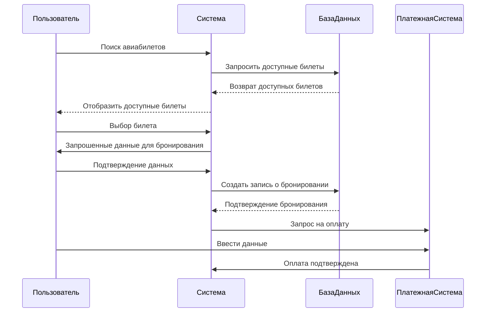
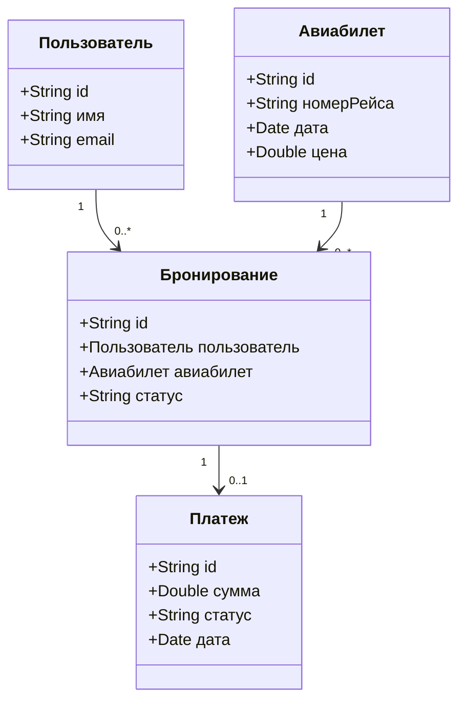
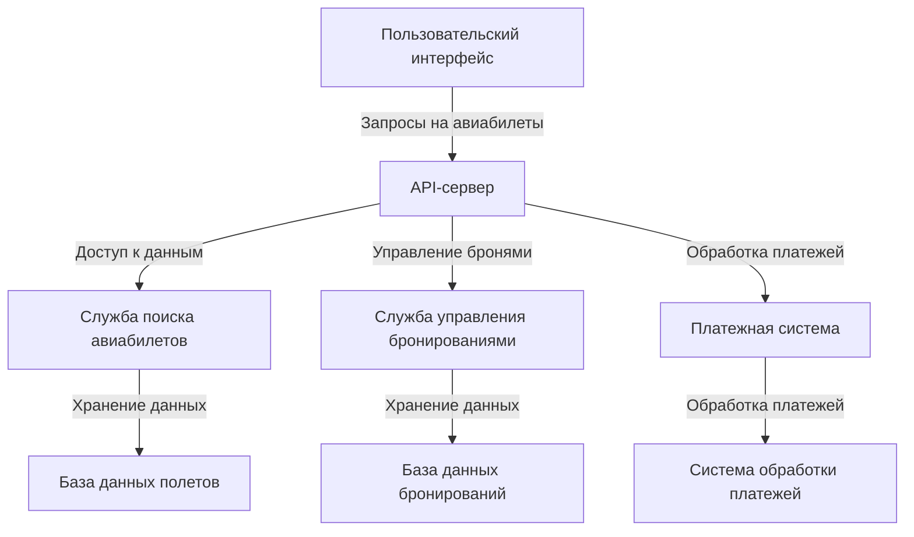

# Поисковик дешевых авиабилетов - Поискоsales
**Пытаетесь найти самые дешевые авиабилеты? Вам к нам**

* быстрее самолёта
* без наценок
* только проверенные авиакомпании

  > летай дешево - летай с поискоsales.

| Не знаешь кто ты?  | Какую собаку завести? | Куда слетать ?|
|:-------------: |:---------------:| :-------------:|
| Алабай         | Самурай          | Парагвай        |

## 1. Схема работы нашего приложения 

Либо же:

# Летай быстро. Летай дешево -
## ~~Летай из окна~~
# Летай с Поискоsales

## 2. Диаграмма классов

## 3. Диаграмма компонентов

---
---
.png)

